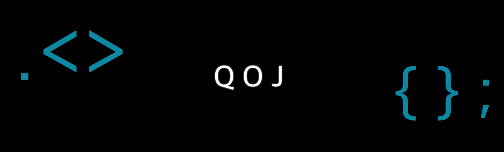

# QOJ - Query Online Judge
<br><br>

<div align=center>
    <strong># Node.js</strong> &nbsp;
    <strong># Javascript</strong> &nbsp;    
    <strong># Flask</strong> &nbsp;
    <strong># uWsgi</strong> &nbsp;
    <strong># NginX</strong> &nbsp;
    <strong># MySQL</strong> &nbsp;
    <br><br>
    <p></p>
</div>
<br>

## What is this?
세종대학교에는 백준 / 프로그래머스와 같이 프로그래밍 언어와 관련된 Online Judge 시스템이 존재합니다.<br>
하지만, 데이터베이스 쿼리와 관련된 Online Judge 시스템은 존재하지 않습니다.

기존 방식의 데이터베이스 관련 수업에서는 학생들의 실습 진행에 상당한 번거로움이 존재합니다.<br>
예를들어, 실습 데이터를 전달받으려면 교수 및 조교가 데이터를 공지사항에 업로드를 하고, 이것들을 학생들이 직접 다운로드해서 본인 PC에 임포트를 하는 방식입니다.<br>
이 과정에서 상당한 시간이 소요되고, 더불어 시험과 과제 진행에서는 환경이 구축된 본인 PC에서 직접 쿼리를 작성하고 결과 값을 캡쳐하여 보고서 형식으로 제출했습니다.

따라서, 이러한 문제점들을 해결하기 위해서 탄생한 것이 바로 QOJ(Query Online Judge) 시스템입니다.

1. 문제 관리
   - 문제 등록
   - 문제 수정
   - 문제 삭제
   - 문제 풀이
2. 통계 기능
   - 분반별 통계
   - 문제별 통계
   - 학생별 통계
3. 부가 기능
   - 쿼리 Explain 제공
   - 인덱스 적용 기능 제공
4. 보안 관련
   - SQL 키워드를 Regix로 판별하여, 학생들은 SELECT 구문만 사용 가능.
   - 애초에 서비스 DB와 학생들의 문제 풀이 DB를 구분하여 구동
   - 트랜젝션을 통한 학생들의 모든 쿼리를 1회 1롤백 진행

<br>

## Dependency
```shell
python 3.7.X
MySQL 5.7.X
```
<br>

## How to use
#### Using Only Node JS
1. Donwload packages by npm
   ```shell
   npm install
   ```
2. Run devserver using webpack
   ```shell
   npm run devserver
   ```
3. If you want to build source?
   ```shell
   npm run build
   npm run production
   ```
4. Connect Host, Port = 8000 or not
   (http://localhost:8000)
   
#### Using Flask

1. Download packages by pip3

   ```shell
   pip3 install -r requirements.txt	// Mac or Linux
   
   pip install -r requirements.txt		// Windows
   ```

2. Run application.py using python
   (your computer must be installed MySQL 5.7.25!)

   ```shell
   python3 application.py		// Mac or Linux
   
   python application.py		// Windows
   ```

3. Connect Host, Port = 5000 or not
   (http://localhost:5000)

<br>

## About Me
🙋🏻‍♂️ Name: 837477

📧 E-mail: 8374770@gmail.com

🐱 Github: https://github.com/837477

<br>

## Contributing
1. Fork this repository
2. Create your feature branch (`git checkout -b feature/fooBar`)
3. Commit your changes (`git commit -m 'Add some fooBar'`)
4. Push to the branch (`git push origin feature/fooBar`)
5. Create a new Pull Request

**Member** : @837477(https://github.com/837477), @NB(https://github.com/altmshfkgudtjr)
